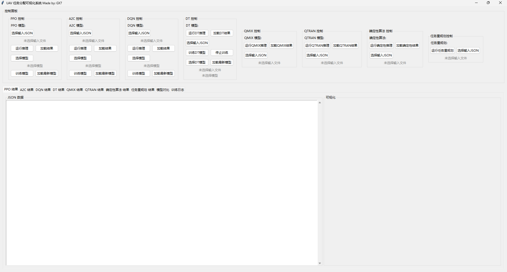

# uav_task_allocation

## 一、基本介绍
本系统为基于无人机任务分配的最终系统，支持训练和推理模式。 整体界面如图所示。



支持的算法包括PPO，A2C，DQN，DT，QMIX，Qtran和基于拉格朗日的确定性算法。其中对于前四种，可以同时支持训练和推理。
QMIX和Qtran的设定则只能支持但整体算法。同时额外添加了任务重规划算法的支持。

## 二、安装和运行说明：
```shell
conda create -n uav_task_allocation python=3.10 -y
conda activate uav_task_allocation
pip install -r requirements.txt
python main.py
```

## 三、使用说明：
1. 推理对于所有算法，都需要先加载输入json，然后再推理，对应所有RL算法，我们提供了test.json来进行测试。
对于拉格朗日算法，则提供了test_deterministic.json进行测试。
2. 加载模型。在不加载训练模型的时候，我们默认加载本地save_models文件夹下的各个模型。

## 四、整体文件结构
说明如下：
```shell
项目根目录/
├── 📂 datasets/                    # 存放DT训练的离线数据集
│   └── 📄 uav_combat_dataset.hdf5      # 训练数据集
├── 📂 figure/                      # 存放环境对应的图片
│   ├── 📂 子弹.jpg                  
│   ├── 📂 背景.jpg 
│   └── 📄 train.py                 # 训练脚本
├── 📂 infer/                       # 推理部分代码
│   ├── 📄 deterministic.py         # 确定性推理代码
│   ├── 📄 infer_mul_alg.py         # PPO,A2C,DQN 推理代码
│   ├── 📄 infer_qmix.py            # QMIX 推理代码
│   ├── 📄 infer_qtrans.py          # Qtrans 推理代码
│   ├── 📄 Main_error.py            # 任务重规划 推理代码
│   └── 📄 infer_dt_new.py          # 基于DT推理代码
├── 📂 outputs_json/                # 推理结果
│   ├── 📂 A2C/                     # A2C结果
│   │   └── 📄 A2C_episode_output_20250913_192224.json      
│   ├── 📂 deterministic /          # 确定性算法结果
│   │   └── 📄 deterministic_output_20250914_213652.json    
│   ├── 📂 DQN /                    # DQN算法结果
│   │   └── 📄 DQN_episode_output_20250913_191951.json    
│   ├── 📂 dt /                     # DT算法结果
│   │   └── 📄 dt_episode_output_20250914_212908.json  
│   ├── 📂 PPO /                    # PPO算法结果
│   │   └── 📄 PPO_episode_output_20250914_163732.json    
│   ├── 📂 Qmix /                   # Qmix算法结果
│   │   └── 📄 qmix_inference_output_20250914_212753.json
│   ├── 📂 replanning /             # 任务重规划算法结果
│   │   ├── 📄 replan_scene1_failure_allocation_output_20250924_185156.json
│   │   ├── 📄 replan_scene2_transfer_allocation_output_20250924_185156.json
│   │   ├── 📄 replan_scene3_transfer_allocation_output_20250924_185156.json
│   │   └── 📄 replan_init_allocation_output_20250924_185156.json
│   └── 📂 QTRAN /                  # QTRANS算法结果
│       └── 📄 qtran_inference_output_20250914_202543.json
├── 📂 save_models/                 # 保存的预训练模型
│   ├── 📄 A2C_best_model.zip               # A2C模型
│   ├── 📄 DQN_best_model.zip               # DQN模型
│   ├── 📄 PPO_best_model.zip               # PPO模型
│   ├── 📄 dt_checkpoint.pt                 # dt模型
│   ├── 📄 qmix_agent.pth                   # qmix模型
│   └── 📄 qtran_agent.pth                  # qtrans模型
├── 📂 train/                      # 训练代码
│   └── 📄 dt_uav.py                  # DT训练代码
├── 📄 requirements.txt            # Python依赖包
├── 📄 config.yaml                 # 配置文件
├── 📄 multi_agent.py              # 多智能体仿真环境
├── 📄 task_allocation.py          # 单智能体仿真环境
├── 📄 test.json                   # RL测试JSON
├── 📄 test_deterministic.json     # 拉格朗日测试JSON以及任务重规划测试json
├── 📄 main.py                     # 主函数代码
└── 📄 README.md                   # 项目说明文档
--
```
